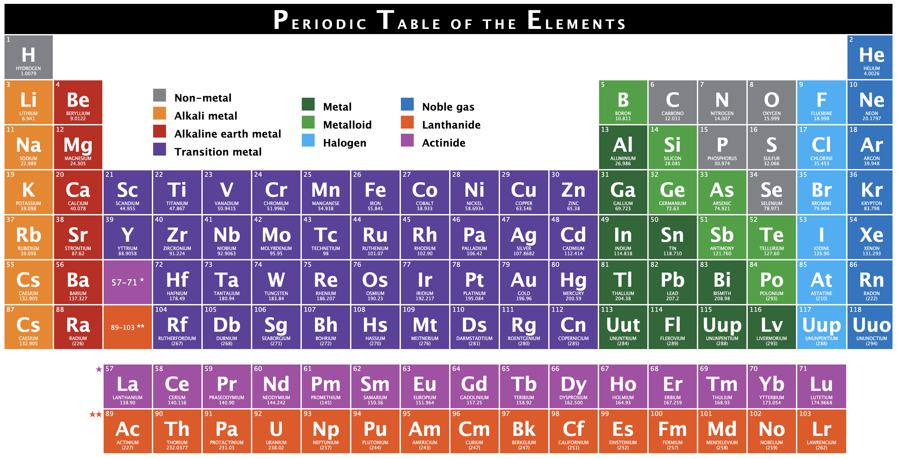

# Periodic Table

## This repository was created to exercise HTML and CSS by creating a periodic-table

### Topics to exercise

- table, thead, tbody, tr, th and td tags
- CSS selectors :nth-child(), :first-child(), :last-child(), etc.
- Responsive Tables
- Counter-reset and counter-increment

[go to the live-page](https://habidbesp.github.io/periodic-table/)

